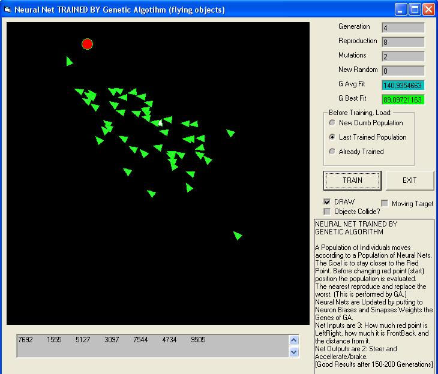



## a Simply Genetic Algorithm And Neural Network PROJECTS \(V2\)

### Description

CONTAINS: Genetic Algorithm Class - Simple and easy to use. + Modified ParasChopra Neural Net by www.paraschopra.com. 

----

EXAMPLE PROJECTS: 

----

[ FILLTHEGRID ]: Example of use of Genetic Algorithm Class (SimplyGA). 

----

[ TSP WITH GA ]: Travel Salesman Problem solved by Genetic Algorithm Class (SimplyGA). 

----

[ XOR ]: Xor Function performed by Neural Net.(Neural net is Trained by Genetic Algorithm Class). 

----

[ FLYERS ]: NEURAL NET TRAINED BY GENETIC ALGORITHM. A Population of Individuals moves according to a Population of Neural Nets. The Goal is to stay closer to the Red Point. Before changing red point (start) position the population is evaluated. The nearest reproduce and replace the worst. (This is performed by GA.) Neural Nets are Updated by putting to Neuron Biases and Sinapses eights the Genes of GA. Net Inputs are 3: How much red point is LeftRight, how much it is FrontBack and the distance from it. Net Outputs are 2: Steer and Accellerate/brake. (This is ARTIFICIAL INTELLIGENCE) /// more will be added/updated /// 09.05.2009 Added Xor_Or_And / Improved Flyers.
 
### More Info
 

             |
---                |---
**Submitted On**   |2009-05-04 23:34:30
**By**             |[reexre](https://github.com/Planet-Source-Code/PSCIndex/blob/master/ByAuthor/reexre.md)
**Level**          |Advanced
**User Rating**    |4.8 (29 globes from 6 users)
**Compatibility**  |VB 6\.0
**Category**       |[Miscellaneous](https://github.com/Planet-Source-Code/PSCIndex/blob/master/ByCategory/miscellaneous__1-1.md)
**World**          |[Visual Basic](https://github.com/Planet-Source-Code/PSCIndex/blob/master/ByWorld/visual-basic.md)
**Archive File**   |[a\_Simply\_G215187582009\.zip](https://github.com/Planet-Source-Code/reexre-a-simply-genetic-algorithm-and-neural-network-projects-v2__1-72047/archive/master.zip)

